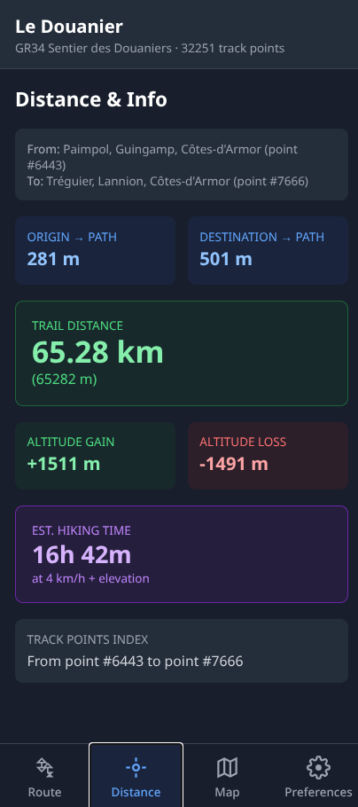

# Le Douanier



## English

A hiking distance calculator for coastal trails in France and any GPX track.

### Origin

This project was created before hiking the **GR34 Sentier des Douaniers** (French customs trail) along Brittany's coastline. The goal was to calculate the actual walking distance between two stages located directly on the trail — accounting for the path's actual winding route, not just a straight line.

Now expanded to support multiple trails and any GPX file.

### What it does

- Search for any place, hotel, or restaurant along the trail
- Select origin and destination points on the trail
- Calculates **trail distance** (not straight-line) between points using the Haversine formula along the GPX track
- Shows elevation gain/loss and estimated hiking time
- Interactive map displaying the full trail and the selected segment
- Download selected trail segment as GPX file

### Supported Trails

- **GR34 Sentier des Douaniers (Brittany)** - ~2090km
- **GR20 Corsica (North-South)** - ~180km
- **Mare e Monti (Corsica)** - ~200km

### Map Features

- **Scale control** - shows metric scale (meters/km) on map
- **Tile layer switcher** - 5 map styles:
  - OpenStreetMap (default)
  - OpenTopoMap (topographic)
  - CyclOSM (cycling/hiking optimized)
  - Satellite (Esri World Imagery)
  - Stadia Maps (smooth terrain)
- **Interactive markers** - red (origin), green (destination), blue (track points)
- **Trail highlighting** - selected segment shown in orange

### App Features

- **5-tab interface**: Trails, Route, Distance/Info, Map, Preferences
- **State machine**: changing route auto-updates results and map
- **Search places** with autocomplete and keyboard navigation
- **Recent places** - stores last 20 places per trail in browser
- **Route history** - remembers last 20 route calculations per trail
- **POI search** - find hotels, restaurants, cafes within 50km
- **Coordinates input** available (toggle in preferences)
- **Dark mode** enabled by default
- **Tab navigation** - Tab key moves between origin/destination/buttons
- **PWA support** - installable as progressive web app
- **Data persistence** - recent places, route history, and preferences stored locally

### Tech Stack

- **Framework**: SvelteKit
- **Styling**: TailwindCSS with dark mode support
- **Map**: Leaflet + OpenStreetMap tiles
- **APIs**: Photon (primary), Nominatim (fallback geocoding), Overpass (POI search) - all free, no API keys
- **Data**: GPX tracks parsed client-side
- **Storage**: LocalStorage for session persistence

### Project Structure

```
src/
├── lib/
│   ├── components/
│   │   ├── TabBar.svelte          # Bottom navigation
│   │   ├── TabGpx.svelte          # Trail selector (clears points on GPX change)
│   │   ├── TabRoute.svelte        # Origin/destination search + keyboard nav
│   │   ├── TabDistance.svelte     # Stats display + download GPX
│   │   ├── TabMap.svelte          # Leaflet map with stats overlay
│   │   └── TabPreferences.svelte  # Dark mode, history, about
│   ├── stores/index.js            # All Svelte stores, localStorage helpers
│   └── utils/
│       ├── geo.js                 # Haversine, GPX parsing, elevation stats
│       ├── geocode.js             # Photon/Nominatim/Overpass API calls
│       └── export.js              # GPX export/download
static/
├── gpx/                          # GPX track files
├── sw.js                        # Service worker (prod only)
├── manifest.json                # PWA manifest
└── icons/                       # App icons
```

### Running

```bash
npm install
npm run dev
```

### Deployment

Automatically deployed to Vercel on `git push` to main branch.

### Features

- **5-tab interface**: Trails, Route, Distance, Map, Preferences
- **State management**: Changing origin/destination auto-updates Distance tab and Map
- **Keyboard navigation**: Arrow keys for dropdowns, Tab between inputs, Enter to select
- **Search**: Photon geocoding with bounding box constraints
- **POI search**: Hotels, restaurants, cafes within 50km (Overpass API)
- **Recent places**: Combined list filtered by current GPX
- **Route history**: Avoids duplicate pairs and same-start-end entries
- **Dark mode**: Enabled by default
- **PWA support**: Service worker (production only)
- **LocalStorage**: History, recent places, and preferences persist across sessions
- **Responsive design**: Works on mobile and desktop

### Version History

- v0020: Added Mare e Monti GPX, map scale control, tile layer switcher (5 providers)
- v0019: Added Tab navigation between inputs, block search after selection
- v0018: Fixed localStorage with get() instead of $store
- v0017: Fixed dropdown closing, updated about, github icon styling
- v0016: Fixed dropdown closing, github icon, localStorage restored
- v0015: Removed localStorage, data session only
- v0014: Fixed localStorage availability check
- v0013: Added POI search via Overpass API
- v0012: Added keyboard navigation for search dropdowns
- v0011: Added "View on Map" button in Distance tab
- v0010: Added map stats overlay showing km, hiking time, alt+ and alt-
- v0009: Added GPX download for selected segment
- v0008: Added GitHub link in About section
- v0007: Added service worker for PWA support (prod only)
- v0006: Added map with trail, markers, and connection lines
- v0005: Added preferences tab with dark mode toggle
- v0004: Added Distance tab with elevation stats
- v0003: Added Route tab with search and recent places
- v0002: Added GPX loading and nearest point calculation
- v0001: Initial SvelteKit setup with TailwindCSS

---

## Français

Un calculateur de distance de randonnée pour les sentiers côtiers en France et n'importe quelle trace GPX.

### Origine

Ce projet a été créé avant de partir sur le **GR34 Sentier des Douaniers** le long de la côte bretonne. L'objectif était de calculer la distance réelle entre deux étapes situées sur le chemin — en tenant compte du tracé sinueux du sentier, et non d'une simple ligne droite.

Maintenant étendu pour supporter plusieurs sentiers et n'importe quel fichier GPX.

### Fonctionnalités

- Rechercher n'importe quel lieu, hôtel ou restaurant le long du sentier
- Sélectionner un point de départ et d'arrivée sur le sentier
- Calcule la **distance effective** (pas la ligne droite) entre deux points en utilisant la formule de Haversine le long de la piste GPX
- Affiche le dénivelé positif/négatif et le temps de marche estimé
- Carte interactive montrant le sentier complet et le segment sélectionné
- Télécharger le segment sélectionné en fichier GPX

### Sentiers supportés

- **GR34 Sentier des Douaniers (Bretagne)** - ~2090km
- **GR20 Corse (Nord-Sud)** - ~180km
- **Mare e Monti (Corse)** - ~200km

### Fonctionnalités cartes

- **Échelle métrique** - affiche l'échelle en mètres/km sur la carte
- **Sélecteur de fond de carte** - 5 styles :
  - OpenStreetMap (par défaut)
  - OpenTopoMap (topographique)
  - CyclOSM (optimisé randonnée/vélo)
  - Satellite (Esri World Imagery)
  - Stadia Maps (relief lissé)
- **Marqueurs interactifs** - rouge (départ), vert (arrivée), bleu (points de piste)
- **Connexion visuelle** - lignes pointillées entre points sélectionnés et piste

### Stack technique

- **Framework**: SvelteKit
- **Style**: TailwindCSS avec mode sombre
- **Carte**: Leaflet + tuiles OpenStreetMap
- **APIs**: Photon (principal), Nominatim (secours), Overpass (recherche POI) - tous gratuits, sans clés API
- **Données**: Tracés GPX parsés côté client
- **Stockage**: LocalStorage pour persistance entre sessions

### Lancer le projet

```bash
npm install
npm run dev
```

### Déploiement

Déployé automatiquement sur Vercel à chaque `git push` sur la branche principale.

### Interface

- **5 onglets** : Sentiers, Route, Distance, Carte, Préférences
- **Machine à états** : changer le départ/arrivée met à jour automatiquement Distance et Carte
- **Navigation clavier** : flèches pour les listes, Tab entre champs, Entrée pour sélectionner
- **Recherche** : Géocodage Photon avec contraintes de zone
- **Recherche POI** : Hôtels, restaurants, cafés dans 50km (API Overpass)
- **Lieux récents** : Liste filtrée par GPX actuel
- **Historique routes** : Évite les doublons et les trajets départ=arrivée
- **Mode sombre** : Activé par défaut
- **Support PWA** : Service worker (production uniquement)
- **LocalStorage** : Historique, lieux récents, préférences persistants
- **Design responsive** : Fonctionne sur mobile et desktop

## License

MIT

© 2025 Le Douanier - Hiking distance calculator